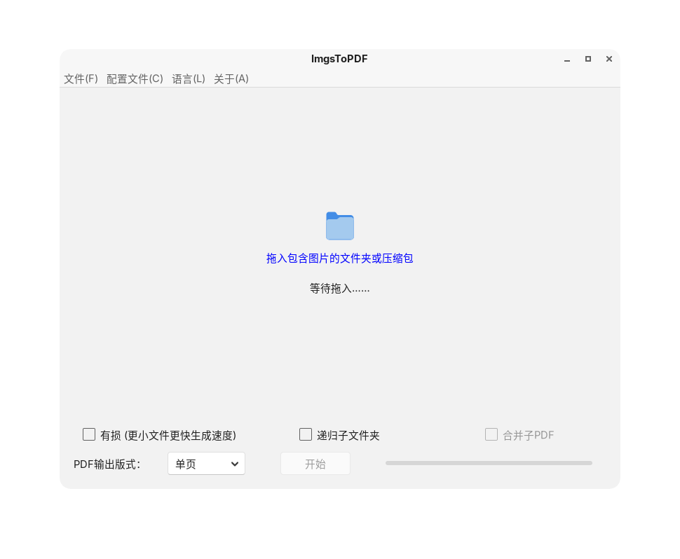

# GTK_ImgsToPDF

## 软件界面

### Windows


### Linux


## 构建与发布

需要 .NET 10 SDK（Linux 上另需 GTK3 运行时，如 `libgtk-3-dev`）。

```bash
# Windows 发布（GUI 单文件 + Core/ 子进程目录）
dotnet publish GTK_ImgsToPDF/GTK_ImgsToPDF.csproj -c Release -r win-x64

# Linux 发布
dotnet publish GTK_ImgsToPDF/GTK_ImgsToPDF.csproj -c Release -r linux-x64
```

发布目录包含 GUI 主程序和 `Core/`（`ImgsToPDFCore` 子进程及其 `config.lua`、`Modules/`）。
Core 由管线自动以自包含单文件方式发布并镜像进来，无需手动复制。

日常调试直接在 IDE 里运行或 `dotnet build`：构建会把 Core 的开发版（框架依赖、仅当前平台）
镜像到输出目录的 `Core\`，开发机装有 .NET 运行时即可运行。

